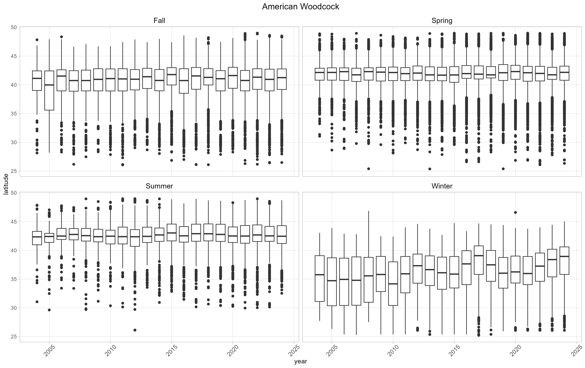

README
================
Nadia Grimaldi
2025-05-13

## Introduction

As climate changes over time, it inevitably affects ecosystems and the
animals that live therein. The purpose of this project is to investigate
how bird migrations in the US may have been affected by these changes
over a twenty year time span.

All data used came from
[eBird](https://science.ebird.org/en/use-ebird-data). Due to the size of
the dataset and the processing time required to clean it, the images
were made in the “data_processing.R” file.

## Data Cleaning

Since there are hundreds of bird species in the US, I needed to decide
which species to use for my analysis. I first used eBird’s [bar charts
of bird sightings](https://ebird.org/GuideMe?cmd=changeLocation) to
determine which birds were abundant enough to have a useable amount of
data. I then used the [status and trends
maps](https://science.ebird.org/en/status-and-trends/species) to remove
any of the selected species which did not migrate significantly or which
had such a broad range that it would be difficult to find trends.
Finally, I narrowed the remaining options down to 18 species, trying to
keep a variety of both migration patterns and types of birds.

After realizing that the dataset took over 400GB of space, I decided I
needed some special tools. Fortunately, there is a software package
called “*auk*” (based in AWK) which is designed to process eBird data
efficiently without pulling the entire file into RAM. Using *auk*, I
copied data on the target species from the full dataset into a new file
of a more manageable size.

 Image provided by eBird
(www.ebird.org) and created \[5/13/2025\]


[Source](https://doi.org/10.2173/WZTW8903)

``` r
knitr::opts_chunk$set(echo = TRUE)
library(tidyverse)
```

    ## Warning: package 'ggplot2' was built under R version 4.4.3

    ## ── Attaching core tidyverse packages ──────────────────────── tidyverse 2.0.0 ──
    ## ✔ dplyr     1.1.4     ✔ readr     2.1.5
    ## ✔ forcats   1.0.0     ✔ stringr   1.5.1
    ## ✔ ggplot2   3.5.2     ✔ tibble    3.2.1
    ## ✔ lubridate 1.9.4     ✔ tidyr     1.3.1
    ## ✔ purrr     1.0.4     
    ## ── Conflicts ────────────────────────────────────────── tidyverse_conflicts() ──
    ## ✖ dplyr::filter() masks stats::filter()
    ## ✖ dplyr::lag()    masks stats::lag()
    ## ℹ Use the conflicted package (<http://conflicted.r-lib.org/>) to force all conflicts to become errors

``` r
library(ggpubr)
```

    ## Warning: package 'ggpubr' was built under R version 4.4.3

``` r
library(auk)
```

    ## Warning: package 'auk' was built under R version 4.4.3

    ## auk 0.8.0 is designed for EBD files downloaded after 2024-10-29. 
    ## No EBD data directory set, see ?auk_set_ebd_path to set EBD_PATH 
    ## eBird taxonomy version:  2024

``` r
library(png)

 species <- c("Northern Shrike", "Trumpeter Swan", "American Woodcock",
               "Red-headed Woodpecker", "Hammond's Flycatcher", "Cassin's Vireo",
               "Broad-tailed Hummingbird", "Gray Flycatcher", "Wilson's Warbler",
               "Clay-colored Sparrow", "Hermit Thrush", "Northern Harrier",
               "Hooded Merganser", "Sandhill Crane", "Black-billed Cuckoo",
               "Palm Warbler", "Summer Tanager", "American Tree Sparrow")
  file_names <- c("ebd_US_norshr_relMar-2025",
                  "ebd_US_trswan_relMar-2025",
                  "ebd_US_woodck_relMar-2025",

                  "ebd_US_rhpeck_relMar-2025",
                  "ebd_US_hamfly_relMar-2025",
                  "ebd_US_casvir_relMar-2025",

                  "ebd_US_bthumm_relMar-2025",
                  "ebd_US_gryfly_relMar-2025",
                  "ebd_US_wlnwar_relMar-2025",

                  "ebd_US_clyspr_relMar-2025",
                  "ebd_US_hrmthr_relMar-2025",
                  "ebd_US_norhar_relMar-2025",

                  "ebd_US_hoomer_relMar-2025",
                  "ebd_US_sdhcra_relMar-2025",
                  "ebd_US_bbcuck_relMar-2025",

                  "ebd_US_plmwar_relMar-2025",
                  "ebd_US_sumtan_relMar-2025",
                  "ebd_US_amtspr_relMar-2025",
                  "ebd_US_hamfly_relMar-2025")
  prefix_image <- "images/"
  prefix_out <- "files/"
  suffix_out <- "_filtered.txt"
  suffix_box <- "_boxplot.png"
  suffix_map <- "_map.png"
  suffix_sum <- "_sum.png"

  keep_cols <- c("global_unique_identifier", "common_name", "observation_count",
                 "age_sex", "state", "latitude", "longitude", "observation_date",
                 "time_observations_started")
  seasons <- c("Spring", "Summer", "Fall", "Winter")

  # color_year <- c("2013" = "#fa8b56", "2014" = "#fca04f", "2015" = "#fb9804",
  #                 "2016" = "#fcbe03", "2017" = "#cec904", "2018" = "#b5ce04",
  #                 "2019" = "#399405", "2020" = "#20bf04", "2021" = "#7ff358",
  #                 "2022" = "#3df189", "2023" = "#25f4d5", "2024" = "#38e2f5",
  #                 "2025" = "#38b4f5")
  months <- factor(c('Jan', "Feb", "Mar",
                     'Apr', 'May', 'Jun',
                     'Jul', 'Aug', 'Sep',
                     'Oct', 'Nov', 'Dec'), ordered = TRUE)
  color_month <- scale_color_manual(values = c('Jan' = '#76efef', "Feb" = '#7ef1cc', "Mar" = '#3df5a8',
                                               'Apr' = '#13bc10', 'May' = '#a6f359', 'Jun' = '#cbcb1a',
                                               'Jul' = '#ede878', 'Aug' = '#ed9c2c', 'Sep' = '#8d460c',
                                               'Oct' = '#bb1a11', 'Nov' = '#f080da', 'Dec' = '#34a4e5'), aesthetics = "color")
  color_season <- scale_color_manual(values = c("Winter" = '#34a4e5', "Spring" = '#f080da',
                    "Summer" = '#13bc10', "Fall" = '#ed9c2c'), aesthetics = "color")
  color_year_scale <- scale_color_gradient2(
    low = '#ede878',
    mid = '#ed9c2c',
    high = '#4d130c',
    midpoint = 2014,
    limits = c(2004, 2024),
    breaks = c(2004, 2009, 2014, 2019, 2024),
    labels = c(2004, 2009, 2014, 2019, 2024)
  )
  color_year_spring <- scale_color_gradient2(
    low = '#f9e7fd',
    mid = '#f080da',
    high = 'grey5',
    midpoint = 2014,
    limits = c(2004, 2024),
    breaks = c(2004, 2009, 2014, 2019, 2024),
    labels = c(2004, 2009, 2014, 2019, 2024)
  )
  color_year_summer <- scale_color_gradient2(
    low = '#e9fde8',
    mid = '#13bc10',
    high = 'grey5',
    midpoint = 2014,
    limits = c(2004, 2024),
    breaks = c(2004, 2009, 2014, 2019, 2024),
    labels = c(2004, 2009, 2014, 2019, 2024)
  )
  color_year_fall <- scale_color_gradient2(
    low = '#fdf4e8',
    mid = '#ed9c2c',
    high = 'grey5',
    midpoint = 2014,
    limits = c(2004, 2024),
    breaks = c(2004, 2009, 2014, 2019, 2024),
    labels = c(2004, 2009, 2014, 2019, 2024)
  )
  color_year_winter <- scale_color_gradient2(
    low = '#e8f4fd',
    mid = '#028cf2',
    high = 'grey5',
    midpoint = 2014,
    limits = c(2004, 2024),
    breaks = c(2004, 2009, 2014, 2019, 2024),
    labels = c(2004, 2009, 2014, 2019, 2024)
  )
  color_year <- c(color_year_spring, color_year_summer, color_year_fall, color_year_winter)

  theme_map <- theme_void() +
    theme(plot.title = element_text(hjust = 0.5),
          axis.text.x = element_blank(),
          axis.text.y = element_blank(),
          legend.direction = "horizontal",
          legend.title.position = "top",
          #legend.key.width = unit(10.5, "mm"),
          legend.title = element_text(hjust = 0.5, size = 9),
          legend.text = element_text(size = 7),
          legend.position.inside = c(0.195, 0.16),
          legend.background = element_blank(),
          legend.ticks = element_line(color = "black"),
          legend.frame = element_rect(color = "black", linewidth = 1),
          plot.background = element_rect(fill = 'white'))
  theme_box <- theme_light() +
    theme(plot.title = element_text(hjust = 0.5, size = 14),
          axis.text.x = element_text(angle = 45, vjust = 0.5, size = 10, margin = margin(0, 2, 0, 2)),
          panel.grid.minor = element_blank())

  states <- map_data("state")
  us_map <- geom_path(aes(x = states$long, y = states$lat, group = states$group))

create_summaries <- function(ebd, i) {
  filename = paste0(prefix_out, file_names[i], "_sum.txt")
  data <- group_by(ebd, year, month)
  sum <- summarise(data, lowest = min(latitude), quartile1 = quantile(latitude)[1],
                   quartile2 = quantile(latitude)[2], quartile3 = quantile(latitude)[3],
                   quartile4 = quantile(latitude)[4],
                   highest = max(latitude), median = median(latitude),
                   mean = mean(latitude), total_observations = dim(data)[1],
                   median_long = median(longitude))
  sum %>% write_tsv(file = filename)

  data <- ungroup(data)
  data$month <- data %>%  mutate(month = factor(month, months))
  data <- group_by(data, month)
  fig <- sum %>% filter(year %in% c(2004:2024)) %>%
    ggplot(aes(x = month, y = median)) +
    geom_path(aes(group = year, color = year)) +
    color_year_scale +
    labs(title = species[i]) +
    theme_box +
    theme(panel.grid.major = element_line(color=('grey70')),
          panel.grid.major.x = element_line(color=('#4d130c'), linewidth = 0.3, linetype = "dashed"),
          panel.grid.minor = element_line(color=('grey85')))
  show(fig)

  fig <- sum %>% filter(year %in% c(2004:2024)) %>%
    ggplot(aes(x = year, y = median, color = month)) +
    geom_smooth(method = lm) +
    labs(title = species[i]) +
    theme_box
  show(fig)
}
  
  # creates a boxplot of latitude over time
create_boxplot <- function(data, i) {
  fig <- ggplot(data) +
    geom_boxplot(aes(x = year, y = latitude, group = factor(year))) +
    labs(title = species[i]) +
    theme_box +
    facet_wrap(~season) +
    theme(strip.text = element_text(size = 12, color = 'black'), strip.background = element_rect(fill = 'white'))
  return(fig)
}

# creates a map for a single season over all years
create_season_map <- function(data, i) {
  data <- filter(data, season == seasons[i])
  fig <- ggplot() +
    us_map +
    theme_map +
    geom_point(aes(x = data$longitude, y = data$latitude, alpha = (0.08), color = data$year)) +
    color_year[i] +
    labs(title = seasons[i], x = NULL, y = NULL, color = "Year") +
    scale_alpha(guide = "none")
  return(fig)
}

# creates maps showing migration over time
create_maps <- function(data) {
  fig1 <- create_season_map(data, 1)
  fig2 <- create_season_map(data, 2)
  fig3 <- create_season_map(data, 3)
  fig4 <- create_season_map(data, 4)

  fig <- cowplot::plot_grid(fig1, fig2, fig3, fig4, nrow = 2)
  return(fig)
}

# creates and saves all figures
create_graphs <- function(data, i) {
  filename <- paste0(prefix_image, file_names[i], suffix_box)
  create_boxplot(data, i)
  ggsave(filename = filename, width = 13.5, height = 8.5)
  filename <- paste0(prefix_image, file_names[i], suffix_map)
  fig <- create_maps(data)
  ggsave(filename = filename, width = 13.5, height = 8.5)
  plot_png <- readPNG(filename)
  plot_png

  ggplot() +
    background_image(plot_png) +
    labs(title = species[i]) +
    theme(plot.title = element_text(hjust = 0.5, size = 14))
  ggsave(filename = filename, width = 13.5, height = 8.5)
}

# create_single_year_map <- function(data, i, in_year) {
#   data <- filter(data, year == in_year)
#   fig <- ggplot() +
#     us_map +
#     theme_map +
#     geom_point(aes(x = data$longitude, y = data$latitude, alpha = (0.08), color = data$season)) +
#     scale_color_manual(values = c('Jan' = '#76efef', "Feb" = '#7ef1cc', "Mar" = '#3df5a8',
#                                                'Apr' = '#13bc10', 'May' = '#a6f359', 'Jun' = '#cbcb1a',
#                                                'Jul' = '#ede878', 'Aug' = '#ed9c2c', 'Sep' = '#8d460c',
#                                                'Oct' = '#bb1a11', 'Nov' = '#f080da', 'Dec' = '#34a4e5')) +
#     labs(title = paste0(species[i], " Sightings in ", in_year), x = NULL, y = NULL, color = "Season") +
#     scale_alpha(guide = "none")
#   return(fig)
# }
```

## Data Visualization

To get a better idea of what the migration patterns looked like, I
created maps showing bird sightings over time by season.

<figure>

<figcaption aria-hidden="true">map</figcaption>
</figure>

## Analysis

With the data cleaned, I began looking at changes in average (median)
latitude over time. Based on this analysis, it appears that birds tend
to be moving farther north over time, and that this is especially
visible in the winter.




